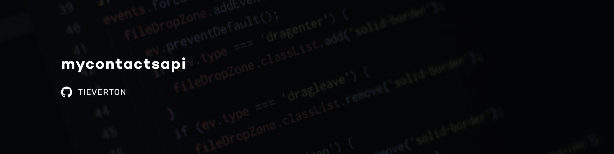

<h1 align="center">
  
</h1>

<p align="center">
  <a href="https://www.linkedin.com/in/evertonpinheiroti/"></a>
  </a>
  
</p>

## 🔖 Summary

- [Project](#-project)
- [Technologies](#-technologies)
- [Getting started](#-getting-started)
  - [Downloading the project](#%EF%B8%8F-downloading-the-project)
  - [Preparing the environment](#-preparing-the-environment)
    - [Database and table](#-database-and-table)
  - [Running the API](#-running-the-api)
- [API Routes](#-api-routes)

## 💻 Project

mycontactsapi was a project created to develop the first contact with backend frameworks, I could create a CRUD (create, read, update, delete) of My Contacts.

## 🔌 Technologies

This project was developed using the following technologies:

- [NodeJS](https://nodejs.org)
- [Express](https://expressjs.com)
- [Docker](https://www.docker.com/)
- [Postgres](https://www.postgresql.org/)
- [ESLint](https://eslint.org)
- [Nodemon](https://nodemon.io/)

## 🚀 Getting started
**Before downloading and running the project**, you must have **Node.js** already installed and then install the following tools:

- [Git](https://git-scm.com/)
- [Yarn](https://classic.yarnpkg.com/lang/en/)
- [Docker](https://www.docker.com/)

### ⬇️ Downloading the project

Clone the project and access the folder

```bash
# Clone the repository and access the directory
$ git clone https://github.com/TIEverton/mycontacts-api.git && cd mycontacts-api

# Install the dependencies
$ yarn
```

### 🌎 Preparing the environment
Using **Docker**, let's download the database image needed to run the API:

```bash
# Download PostgreSQL
docker run --name pg -e POSTGRES_PASSWORD=docker -p 5432:5432 -d postgres
```
To find out if postgres is running, run the following command:

```bash
docker ps
```

If not, run the following command:

```bash
docker start pg
```

**Note:** if you want to stop execution, replace `start` with `stop`.

### 🎲 Database and table
To create the tables in the database use the schema provided in path `src/database/schema.sql`

### 🏃 Running the API
With the database running and being in the API directory, execute the following commands:

```bash
# Run the server
yarn dev
```

## 📌 API Routes

To test routes, you can use [Insomnia](https://insomnia.rest/). The complete **_workspace_** of this API is available for use, just click on the button below:

[](https://insomnia.rest/run/?label=mycontacts&uri=https%3A%2F%2Fgist.githubusercontent.com%2FTIEverton%2F3bd9ac760b5219b01fb3a74de3de5341%2Fraw%2F46106498996f291d16aa6d9875731a579bb0a1ee%2Fmycontacts.json)

---

Made with ♥ by Everton Pinheiro 👋🏻
